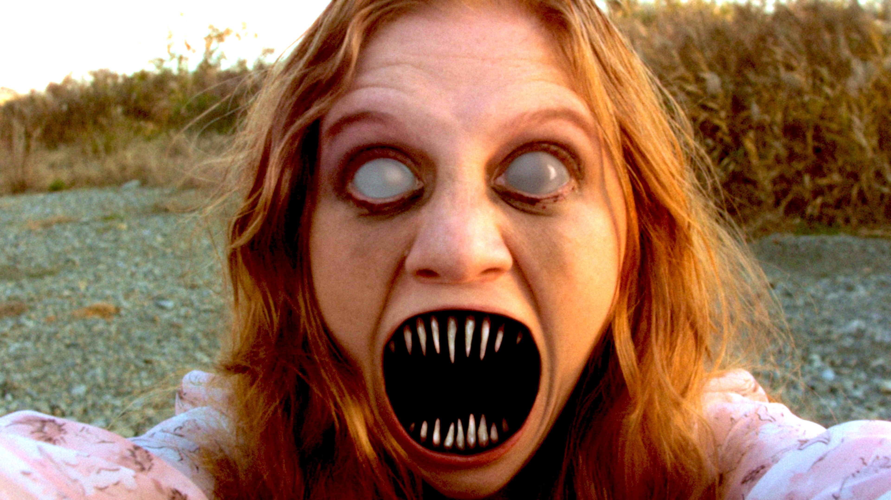

# RATTLE!

An open source narrative horror video about man who finds himself at peace, having a picnic with a woman he doesn't know, at a place he can't recall. The bliss is short lived. 



## Status

Postproduction 🖥️ | [Latest Nightly Export](https://archive.org/details/1801-final-tweaks-2)

## Quick Start

1. Download and prepare repo

```bash
git clone https://github.com/grantcko/RATTLE.git
cd RATTLE
python3 -m venv .venv
source .venv/bin/activate
pip install -r requirements.txt
```

2. Open the DaVinci Resolve project

```bash
open -a "DaVinci Resolve"
# Opens latest project version (RATTLE_vNNN) automatically
python3 rscripts/import_project.py
```
**Manually**: Open DaVinci Resolve and use "File > Import Project" to open the latest `.drp` from `project/projects`.

3. Import a timeline

```
python3 rscripts/import_timeline.py project/timelines/<timeline_name>
```
**Manually**: In DaVinci Resolve, right-click the Timelines bin and choose "Import Timeline" to select a `.drt` file from `/project/timelines`

2. Download and connect large files

Full Sized Footage
```bash
ia download rattle-footage --destdir "<path/to/your/footagestorage>"
```
Or download manually from: [https://archive.org/details/rattle-footage](https://archive.org/details/rattle-footage)

Scene 1 film share: [footage/film/film-share-sc1.mov](https://archive.org/download/rattle-footage/footage/film/film-share-sc1.mov)

Proxy Footage
```bash
ia download rattle-proxies --destdir "path/to/proxystorage"
```
Or download manually from: [https://archive.org/details/rattle-proxies](https://archive.org/details/rattle-proxies)

Audio
```bash
ia download rattle-audio --destdir "path/to/audiostorage"
```
Or download manually from: [https://archive.org/details/rattle-audio](https://archive.org/details/rattle-audio)

Resolve project audio captures/renders: [rattle-project-audio-captures-renders-20260702.zip](https://archive.org/download/rattle-audio/rattle-project-audio-captures-renders-20260702.zip). Unzip this from the repo root if Resolve asks for missing files under `project/RATTLE_1/Capture` or `project/RATTLE_1/Audio Files/Renders`.

Miscellaneous
```bash
ia download rattle-00-source-misc --destdir "path/to/miscstorage"
```
Or download manually from: [https://archive.org/details/rattle-00-source-misc](https://archive.org/details/rattle-00-source-misc)

## Requirements

- Python 3.10+
- Dependencies from `requirements.txt`
- DaVinci Resolve installed with scripting enabled (`DaVinciResolveScript.py` available)
- `ia` CLI available (provided by the `internetarchive` dependency)

## Project Structure

- The Resolve project has a 00-SOURCE bin that is a direct mirrored import of the "source" folder 00-source. `Folder` = actual folder on disk. `Bin` = Resolve's version of a "folder" in the media pool. 
- Project only bins: for timelines, compound/fusion clips, capture audio. *Mostly* for resolve "items" - not actual files.
- DaVinci Resolve project files are databases and are not ideal for direct multi-user git collaboration, so this repo uses exported and versioned artifacts  under `project/`. 

### Projects (.drp)

Stored at `project/projects/`.

- Major checkpoints only (not every timeline change)
- Contains source/media structure and project settings
- Intentionally no timelines
- Versioned as `vNNN`

### Timelines (.drt)

Stored at `project/timelines/`.

- Versioned as `MMmm-[category]` (example: `1406-sound`)
- Import the timeline you are working on
- Use `rscripts/import_timeline.py` to reduce duplicate media-pool clutter from timeline import

## Contributing

See [CONTRIBUTING.md](CONTRIBUTING.md).

## Plot

### Scene 1

- tea is poured
- lady asks "where are we?"
- man does not know
- she keeps asking him
- he freaks out
- she grabs his face and turns into a monster with the scream of an alarm clock

### Scene 2

- alarm clock (sound carries over)
- he wakes up from nightmare

### Scene 3

- on balcony
- wife comes out and pours tea (it is the lady in the dream)
- Man: "I want a divorce"

## Credits

| Role | Credit | Instagram |
| --- | --- | --- |
| Director/Producer | Grant Hall | |
| Cinematographer/Producer | David Narbecki | [@davidnarbecki](https://www.instagram.com/davidnarbecki/) |
| The "Woman" | Jalani Blankenship | [@jalaniblankenship](https://www.instagram.com/jalaniblankenship/) |
| The "Man" | Reza Emamiyeh | [@rezwearzbowtiez](https://www.instagram.com/rezwearzbowtiez/) |
| Gaffer | Ben Gonzalez | [@ben.r.g_visuals](https://www.instagram.com/ben.r.g_visuals/) |
| Makeup Artist | Kaye Narita | [@kayemakeup](https://www.instagram.com/kayemakeup/) |
| Assistant Camera/BTS | Andrew Alter | |
